<h1 align="center">UXCLI</h1>

<p align="center"><strong>Design should be executable.</strong></p>

<p align="center">
  <code>uxcli</code> drives a real browser against the commitments that produced your UI,<br>
  and returns a verdict the agent that wrote the code is not allowed to author.
</p>

<p align="center">
  <a href="https://www.npmjs.com/package/@junixlabs/uxcli"></a>
  <a href="#install"></a>
  <a href="LICENSE"></a>
</p>

<p align="center">
  
</p>

<p align="center"><sub>A real run against the fixture shipped in <code>src/probes/focus-visible/must-fail/</code>. Regenerate with <code>npm run clip</code>.</sub></p>

---

## No commitment, no verdict

A commitment is a threshold with a named owner and a written source. W3C is a named owner, so WCAG runs by default. Nobody signed taste, so taste never runs.

Every finding cites the commitment it enforces — `spec`, `project`, or `opinion`. Where no one has committed, `uxcli` says nothing: `not-committed`, never `fail`. Where it cannot measure: `unmeasurable`, never `pass`.

A review tool that lies three times is disabled forever. This is the rule that keeps it installed.

## Why it exists

- **Page-level tools cannot see between screens.** Data entered on step 1 missing from the review on step 3; navigation order changing between pages. WCAG 3.3.4, 3.3.7 and 3.2.3 have no ACT rule and none in axe-core.
- **Agents cannot see what they render.** The failure is not blindness, it is false confirmation: handed a screenshot of a broken UI, the agent reports success.
- **One false positive and the tool is off.** So a probe that cannot be made to fail on demand is not allowed to say `fail`.

## Install

Node 20+.

```bash
npm install -g @junixlabs/uxcli
npx playwright-core install chromium-headless-shell   # once, or set UXCLI_CHROME
uxcli run https://example.org/login --prove
```

`npx @junixlabs/uxcli <command>` works without installing.

## What it measures

Eight probes. The **method** column is the load-bearing one: a probe is `method-validated` only after a recorded run with the packaged code on ≥20 pages or flows it had not seen when its definition was last revised, with 0 false fails and a recall record. Unproven probes report `finding` and never change the exit code.

| Scope | Probe | Criterion | Provenance | Method |
|---|---|---|---|---|
| screen | `focus-visible` | WCAG 2.4.7 | spec | ✅ validated · 20 unseen pages, 0 false fails |
| screen | `contrast` | WCAG 1.4.3 | spec | ✅ validated · 80 unseen pages, 0 false fails |
| screen | `text-spacing` | WCAG 1.4.12 | spec | ✅ validated · 80 unseen pages, 0 false fails |
| screen | `text-overlap` | — text painted over text | **opinion** | ⏳ unproven → reports `finding` |
| flow | `error-prevention` | WCAG 3.3.4 | spec | ⏳ unproven → reports `finding` |
| flow | `error-identification` | WCAG 3.3.1 | spec | ⏳ unproven → reports `finding` |
| flow | `redundant-entry` | WCAG 3.3.7 | spec | ⏳ unproven → reports `finding` |
| flow | `consistent-navigation` | WCAG 3.2.3 | spec | ⏳ unproven → reports `finding` |

Nine verdicts — `pass`, `fail`, `finding`, `not-applicable`, `not-committed`, `unmeasurable`, `suppressed`, `stale`, `untested`. **Only `fail` blocks a merge.**
Exit codes: `0` no fail · `2` at least one fail · `1` the run could not be carried out.

### A pass has to earn it

`--prove` plants, for every probe that passed, the exact defect that probe exists to catch — focus styles set equal to the unfocused ones, text blended into its background, a spacing lock below the minimum — confirms by computed style that the defect reached the elements the probe measured, then re-measures. Each pass then reads `would fail on …`, or warns that it could not be made to fail.

Every probe also ships a falsification pair: one fixture where it must fail, one clean twin where it must reach `pass` through its satisfied branch. Silence on the clean twin does not count. `uxcli gate` enforces all of it, and a probe without a pair cannot say `fail`.

## Commitments

The one input the machine cannot derive is written by a human, and versioned.

**A journey** is the commitment for a flow: the steps of one process, which step commits, and what the human declares (`sameProcess`, `checkedPass`, `reversible`). See [`test/journeys/checkout.json`](test/journeys/checkout.json).

**`uxcli.commitments.json`** is where a project commits to its own thresholds — each entry carries `id`, `kind`, `why`, an `owner` and a `source`. No owner and source means `not-committed`; `"suppressed": "<reason>"` is reported, never silently skipped. Today one kind is measured: `contrast`, read from the project's declared design tokens by `uxcli sheet --src=DIR`.

**The agent may propose. It may not commit.** `uxcli discover` writes journey candidates with `provenance: proposal` and `confirmedBy: null`, and `run` refuses them until a human confirms.

## For coding agents

`uxcli init` copies three skills into a project's `.claude/skills/`:

| Skill | What it changes |
|---|---|
| `before-done` | the agent runs the instrument before saying the UI is finished |
| `journey` | keeps a proposal out of the confirmed directory |
| `principles` | keeps the agent from writing the commitments file itself |

Each was tested against fresh agent sessions on the same task without it; the record is in [`skills/pair.json`](skills/pair.json) and `gate` checks it by hash. What the skills do not add, the card already does: across 45 sessions no agent — with or without a skill — said done holding a `FAIL`, or called a `FINDING` a pass.

## Commands

```bash
uxcli run <journey.json>        # measure a flow          --json --out=DIR --refute --var=k=v
uxcli run <url>                 # measure one screen      --prove --state=FILE --src=DIR
uxcli sheet [--src=DIR]         # the project's own token commitments, no browser
uxcli diff <a.json> <b.json>    # drift between two saved runs        --gate exits 2 on a new fail
uxcli discover <repo|url>       # journey candidates, as proposals
uxcli gate                      # every probe's falsification pair must hold
uxcli why <rule>                # a probe's full definition: why · applies-when · correct-when
uxcli init [dir]                # copy the skills, create .uxcli/, print the CI step
```

`--refute` spawns a fresh second reader per fail (default `claude -p`, haiku, Read-only, ~US$0.04) to dispute it from the screenshots alone. It announces command, count and cost on stderr first, and nothing runs without the flag.

## Feedback

Every run leaves `run.json` and screenshots in `.uxcli/<host or journey>/`. Two forms at [issues/new/choose](https://github.com/junixlabs/uxcli/issues/new/choose):

- **A verdict is wrong, or something was missed** — attach the packet. "It looks fine" is not evidence; a screenshot of the same state is.
- **Offer a flow for the unseen list** — twenty confirmed journeys with 0 false fails flip a flow probe from `finding` to `fail`. It is the only way they flip.

A report is re-measured, not re-read. A confirmed false fail becomes a must-pass case and a spec revision; a confirmed miss becomes a must-fail case. The outcome is written back on the issue.

## Non-goals

Conformance certification · visual regression · scores · design critique.

Where it is going, and in what order: [ROADMAP.md](ROADMAP.md). The reasoning behind the rules: [VISION.md](VISION.md).

## License

MIT — see [LICENSE](LICENSE).
