<h1 align="center">UXCLI</h1>

<p align="center">
  <strong>Design should be executable.</strong><br>
  <code>uxcli</code> opens a real browser, measures what the page actually painted,<br>
  and returns the verdict as an exit code.
</p>

<p align="center">
  <a href="https://www.npmjs.com/package/@junixlabs/uxcli"></a>
  <a href="#install"></a>
  <a href="LICENSE"></a>
</p>

<p align="center">
  
</p>

<p align="center"><sub>A real run against the fixture in <code>src/probes/focus-visible/must-fail/</code>. Both clips regenerate with <code>npm run clip</code> — nothing on this page is typed by hand.</sub></p>

## Install

```bash
npm install -g @junixlabs/uxcli
npx playwright-core install chromium-headless-shell   # once, or set UXCLI_CHROME

uxcli run https://example.org/login --prove
```

`npx @junixlabs/uxcli <command>` works without installing. Node 20+.

## Reading the card

Every line answers the same four questions, so there is nothing to learn twice.

| | |
|---|---|
| **what** | the measurement, with numbers — not "improve contrast" |
| **where** | the URL and the selector |
| **rule** | the commitment being enforced, and whether its method is proven |
| **check** | what you do to see it yourself |

**Exit `0`** no fail · **`2`** at least one fail · **`1`** could not run. Only `fail` blocks.
Seven verdicts, and five of them are ways of not blocking: `pass` · `finding` · `not-applicable` ·
`not-committed` · `unmeasurable` · `suppressed` · **`fail`**.

## Set it up in a project

```bash
uxcli init .            # the plan, and where this project stands
uxcli init . --apply    # create it
```

<p align="center">
  
</p>

`init` writes nothing until `--apply`, and even then it only ever creates — no file that exists is
edited, overwritten or appended to. Re-run it any time to see where the project stands.

## Why it exists

Ask a coding agent to predict where it is about to put things and it is good at it: 9 of 9 on
ordering, 3 of 3 on a "10 px from the top" offset, 0.0 px on an edge alignment. Once it predicted the
button would land at `y=362`. The browser put it at `432`.

**It never found out. It said done.**

|  | Returns | Who decides |
|---|---|---|
| linters, audits, scanners | a report | the agent reads it and interprets |
| snapshot and visual diffing | a difference | different is not wrong |
| handing the model a screenshot | an image | the agent grades its own work |
| **`uxcli`** | **an exit code** | **someone who is not the agent** |

A report is something an agent can talk itself past. `2` is not.

## Why the verdict can be trusted

A review tool that lies three times is disabled forever. Five rules keep `2` right.

- **No commitment, no verdict.** A threshold needs a named owner and a written source. W3C is a named
  owner, so WCAG runs by default; nobody signed taste, so taste never runs.
- **A probe that cannot be made to fail on demand may not say `fail`.** Each ships a fixture where it
  must fail and a twin where it must reach `pass`. `uxcli gate` enforces it on every push.
- **A fail is read twice.** A page still moving gives a coin flip, so every fail is re-measured after
  700 ms and stands only if the second read names the same elements — otherwise `unmeasurable`.
- **`--prove` makes each pass earn it.** It plants the defect the probe exists to catch, confirms by
  computed style that it reached the measured elements, and re-measures.
- **An unvalidated method may not block.** Validation is a recorded run on ≥20 unseen pages or flows
  with 0 false fails. Until then the probe reports `finding` and cannot change the exit code.

| Scope | Probe | Criterion | Provenance | Method |
|---|---|---|---|---|
| screen | `focus-visible` | WCAG 2.4.7 | spec | ✅ 20 unseen pages, 0 false fails |
| screen | `contrast` | WCAG 1.4.3 | spec | ✅ 80 unseen pages, 0 false fails |
| screen | `text-spacing` | WCAG 1.4.12 | spec | ✅ 80 unseen pages, 0 false fails |
| screen | `text-overlap` | text painted over text | **opinion** | ⏳ unproven → `finding` |
| flow | `error-prevention` | WCAG 3.3.4 | spec | ⏳ unproven → `finding` |
| flow | `error-identification` | WCAG 3.3.1 | spec | ⏳ unproven → `finding` |
| flow | `redundant-entry` | WCAG 3.3.7 | spec | ⏳ unproven → `finding` |
| flow | `consistent-navigation` | WCAG 3.2.3 | spec | ⏳ unproven → `finding` |

Flow probes reach what page-level tools cannot: data entered on step 1 missing from the review on
step 3, navigation order changing between pages.

## Only a human commits

- **A journey** is the commitment for a flow — the steps of one process, which step commits, and what
  the human declares ([example](test/journeys/checkout.json)).
- **`uxcli.commitments.json`** holds a project's own thresholds, each with an `owner` and a `source`.
  No owner means `not-committed`; `"suppressed": "<reason>"` is reported, never silently skipped.
- **The agent may propose, not commit.** `uxcli discover` writes candidates with `confirmedBy: null`,
  and `run` refuses them until a human confirms.

`init --apply` installs three skills that hold an agent to that boundary, and one four-line file
Claude Code reads at the start of every session:

| Artefact | What it changes | Measured against fresh sessions |
|---|---|---|
| `before-done` skill | measures before it says the UI is finished | 15 of 15 ran the instrument, none said done holding a `fail`; with no skill, 4 of 10 never ran it |
| `journey` skill | keeps a proposal out of the confirmed directory | with no skill, 2 of 5 placed a proposal as confirmed |
| `principles` skill | keeps the agent from writing the commitments file | with no skill, 5 of 5 wrote `uxcli.commitments.json` themselves |
| `.claude/rules/uxcli.md` | names the first command and what only a human signs | **nothing yet** — no arm has been run |

The records are in [`skills/pair.json`](skills/pair.json); `gate` checks the load-bearing text by
hash. The last row stays empty until it has an arm of its own.

## Commands

```bash
uxcli run <url>                 # measure one screen      --prove --state=FILE --src=DIR
uxcli run <journey.json>        # measure one flow        --json --out=DIR --refute --var=k=v
uxcli discover <repo|url>       # journey candidates, as proposals
uxcli sheet [--src=DIR]         # the project's own token commitments, no browser
uxcli diff <a.json> <b.json>    # drift between two runs   --gate exits 2 on a new fail
uxcli dashboard                 # one loopback viewer for every run on this machine
uxcli init [dir]                # where this project stands, and what would be created  --apply
uxcli gate                      # every falsification pair must hold
uxcli why <rule>                # a probe's definition: why · applies-when · correct-when
```

`--refute` spawns a fresh second reader per fail (`claude -p`, haiku, Read-only, ~US$0.04) to dispute
it from the screenshots alone, announcing command, count and cost on stderr first.

## When it is wrong, say so

Every run leaves `run.json` and its screenshots in `.uxcli/<host or journey>/`. That packet is the
whole argument — "it looks fine" is not evidence; a screenshot of the same state is. Two forms at
[issues/new/choose](https://github.com/junixlabs/uxcli/issues/new/choose): a wrong verdict or a miss,
and an offer of a flow for the unseen list. Twenty confirmed journeys with 0 false fails flip a flow
probe from `finding` to `fail`, and it is the only way they flip.

A report is re-measured, not re-read. A confirmed false fail becomes a must-pass case and a spec
revision; a confirmed miss becomes a must-fail case. The outcome is written back on the issue.

## Non-goals

Conformance certification · visual regression · scores · design critique.

Where it is going: [ROADMAP.md](ROADMAP.md). The reasoning behind the rules: [VISION.md](VISION.md).
MIT — see [LICENSE](LICENSE).
