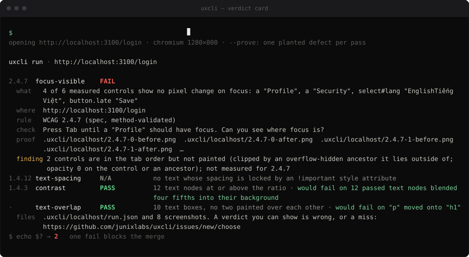

<h1 align="center">UXCLI</h1>

<p align="center">
  <strong>Make a coding agent design like a designer who did the research:<br>learn the field, design from cited principles, then walk the journey in real Chrome before it says done.</strong>
</p>

<p align="center">
  <a href="https://www.npmjs.com/package/@junixlabs/uxcli"></a>
  <a href="#install"></a>
  <a href="LICENSE"></a>
</p>

Paste this to your agent:

> Install the `uxcli` skill (`npx skills add junixlabs/uxcli -g`), run `npx -y @junixlabs/uxcli doctor`, and from now on read `uxcli context show <journey>` before you design a screen, draw its variants and run `uxcli mockups` before you build, and run `uxcli run` on the final files before you say done.

Or see it work first, in under a minute, on a product with a defect planted on purpose:

```bash
npx -y @junixlabs/uxcli demo ./uxcli-demo
```

<p align="center">
  
</p>

## What it is

A coding agent designs from what it assumes. uxcli gives it what a designer who did the research would
have, and an instrument to prove the result works for the person using it:

- **Knowledge** — a library the agent can cite: 167 rules from named designers, design systems and
  studies, each with its author, page and exact words, packaged by kind of UI (`marketing`, `content`,
  `data`, `workspace`, `shop`, `transaction`) and by topic (colour, writing, data display, forms); and
  templates for kinds of product (`workspace`, `shop`, `landing`) that name the screens, the lens for
  each, the journeys to walk first and the questions research must answer.
- **Process** — research the field from sources, write insights with evidence and open questions as
  unknowns, read `uxcli context show` before designing, draw variants to the lens, build the one a
  person picks.
- **Evidence and versions** — every walk of a journey leaves `run.json`, screenshots and the trace;
  picks and revisions are hashed to the drawing they speak of; `uxcli map` lays the journey out step by
  step.
- **Experience validation** — `uxcli run` walks the journey in real Chrome and checks what the person
  goes through, not only how the page is built. Checks proven able to fail may block; designer rules
  and walkthroughs are reported as findings with their source, never as a pass.

uxcli writes no claim about your users. Every sentence on a card was authored by the project, quoted
from a cited source, or measured by the browser.

## Install

| Agent | Skill | Instrument |
|---|---|---|
| Claude Code | `npx skills add junixlabs/uxcli -g` or `uxcli init --apply` (copies `.claude/skills/uxcli/` and a rule file) | `npx -y @junixlabs/uxcli` |
| Codex | `npx skills add junixlabs/uxcli -g --agent codex` | same |
| opencode | `npx skills add junixlabs/uxcli -g --agent opencode` | same |
| Cursor | `npx skills add junixlabs/uxcli -g --agent cursor` | same |

```bash
npm install -g @junixlabs/uxcli
npx playwright-core install chromium-headless-shell   # once, or set UXCLI_CHROME
uxcli doctor                                          # node, Chromium, project, policy — and the fix for each
```

Node 20+. `npx -y @junixlabs/uxcli <command>` works without installing.

## The sequence

```bash
uxcli init --apply --origin=http://localhost:3000    # a rule file, the skill, .uxcli/ with the floor policy
uxcli template show workspace                        # the kind of product: screens, lens per screen, what to research
uxcli context show handle-inbound-lead               # read before you design
uxcli mockups                                        # the screens drawn as the journey's flow; a person picks
uxcli lens show workspace                            # named designers' viewpoints for this kind of UI
uxcli review check                                   # every lens review complete, fresh, not contradicted by a probe
uxcli run .uxcli/journeys/handle-inbound-lead.json   # measure after
uxcli run http://localhost:3000/leads/1 --prove      # one screen: five probes, each pass made to earn it
uxcli experience --page                              # what the person goes through on each journey, pinned on the screenshots
uxcli map                                            # the journey as screens: declared, observed, the difference, the verdicts
```

`context show` prints, in this order: the actor's `unknowns[]` (so a gap is never turned into a
fact), who the actor is, each insight at the confidence its evidence allows, the states the screen
must be able to hold with the `data-uxcli` hooks each needs, the commitments already signed over it,
and what the last run saw. It gives no advice.

`mockups` photographs every variant the agent drew under `.uxcli/mockups/<state>/` and writes one
page: each journey as a flow of the picked variants, connected from the element the next step acts
on, and each screen's variants side by side — green picked, amber part of a pick, grey not taken.
A person picks in `pick.json`; the agent never picks for them. Ticking a variant on the page fills in the
`pick.json` to write, hash included; the page itself writes nothing. The picked variant is what gets built.
A palette shared in `mockups/_shared/tokens.css` is covered by the pick's hash, and each variant's
receipt names the colours it paints off that palette. Further viewports (`--viewport=1440x900,390x844`)
are photographed beside the first, and an element carrying `data-uxcli-note` gets a numbered pin on the frame.
Each lane plays as a prototype: the hotspot leads to the next picked frame, arrow keys step, Escape closes;
a journey with several lanes plays whole. A variant opens large with its pins and the journey's hooks
outlined where the browser found them (the `hooks` toggle shows them on the thumbnails too); two variants ticked `compare` sit side by side;
the journey tabs filter the page to what one journey names. A picture someone made of a screen goes in
`refs/` under that screen and is shown as a reference, never as a variant.

`lens` is a library of viewpoints from named designers and design systems, 167 of them: four schools — usability
(Nielsen, Norman, Krug, Baymard, Wroblewski, GOV.UK), practitioner craft (Wathan & Schoger, Kennedy),
the classic canon (Rams, Vignelli, Müller-Brockmann, Bringhurst, Butterick, Tufte, Gestalt via NN/g) and
modern product craft (Rauno Freiberg, Emil Kowalski, Linear, Vercel, Apple, Material, Ström, Brignull) —
and four topic pools drawn from public design systems and WCAG (colour, writing and microcopy, data
display, forms: GOV.UK, USWDS, Carbon, Primer, Polaris, Mailchimp, W3C) —
each with its author, work, page and words, packaged by the kind of UI it is read against: `marketing`,
`content`, `data`, `workspace`, `shop`, `transaction`. Viewpoints that several schools state as one rule
are one line of the checklist. The lenses live inside the skill (`skills/uxcli/lenses/<kind>.md`, installed
into the project by `init`), so an agent reads the checklist for its kind of UI before it draws. `uxcli review <state>/<variant> --lens=<kind> --write` puts an empty review
beside a drawing; the agent answers every viewpoint (holds with where, breaks with where and why, n/a with
why) looking at the photograph, and `uxcli review check` refuses a review that skips one, is older than the
drawing, or says `holds` where a probe the viewpoint names counted a break. The mockups page shows each
review on its variant as the reviewer's claim. uxcli holds the library and checks the form; the rules are the
designers', and a review is never a verdict. Every lens is on; `.uxcli/lenses.json` turns one off, with a name.

`map` writes one page for the whole project: each journey as a strip of steps on a canvas, with
four views — MODEL (the picked mockups), RUN (the last run's screenshots, each state held or not),
DIFF (declared beside observed) and IMPACT (what the commitments decided) — a side panel per step
(before/after, API, state, evidence, commitment, run) and a findings list. A step is marked drift
only when the run said a state did not hold or a commitment failed there.

`run` reads each state's signals in the browser — URL, DOM, text, network, accessibility tree,
storage — walks the journey's workflows, provisions identity and fixtures only as far as the policy
allows, and decides every commitment whose scope it reached. Every run leaves
`.uxcli/runs/R-<when>-<six>/run.json` and its `artifacts/`; nothing is ever overwritten.

## Reading the card

Every line answers the same four questions.

| | |
|---|---|
| **what** | the measurement, with numbers — not "improve contrast" |
| **where** | the step, the state, the selector |
| **rule** | the commitment being enforced, its owner, and whether its method is proven |
| **check** | what you do to see it yourself |

**Exit `0`** no fail · **`2`** at least one fail · **`1`** the run could not be carried out (blocked
by policy, identity or reach — not a UX verdict). Seven verdicts, and five of them are ways of not
blocking: `pass` · `finding` · `not-applicable` · `not-committed` · `unmeasurable` · `suppressed` ·
**`fail`**. A `finding` is a would-be fail from a method not yet validated; it is never a pass.

## The files

One directory, five kinds of thing, and the kind decides who writes it and whether git keeps it:

| Kind | Where | Written by | Tracked |
|---|---|---|---|
| authored | `understanding/`, `journeys/`, `commitments/`, `profiles/`, `policy/`, `project.json` | a person, or an agent with the person's say-so | yes |
| derived, persistent | `proposals/` | an agent or `uxcli propose`; a commitment cites the proposal it came from | yes |
| derived, rebuildable | `index.json` | `uxcli init`; delete it and it is rebuilt | no |
| observed, immutable | `runs/R-…/` | `uxcli run`; made once, never edited, pruned to seven per target unless anchored | no |
| runtime only | identity, fixtures | the project's provisioner, under policy | never on disk |

The shape of every file: [`examples/crm/.uxcli/`](examples/crm/.uxcli/) and
[`schemas/`](schemas/). Take the shape, not the facts.

## Why the verdict can be trusted

- **No commitment, no verdict.** A threshold needs a named owner and a written source. W3C is a named
  owner, so WCAG runs by default; nobody signed taste, so taste never runs.
- **A probe that cannot be made to fail on demand may not say `fail`.** Each ships a fixture where it
  must fail and a twin where it must pass. `uxcli gate` enforces it on every push, along with every
  rule in this README that can be stated as a pair.
- **A fail is read twice.** A page still moving gives a coin flip; a fail stands only if the second
  read names the same elements — otherwise `unmeasurable`.
- **`--prove` makes each pass earn it.** It plants the defect the probe exists to catch and re-measures.
- **An unvalidated method may not block.** Until a method is validated on unseen pages with 0 false
  fails, it reports `finding` and cannot change the exit code.
- **The skill is measured, not asserted.** Each load-bearing paragraph in
  [`skills/uxcli/`](skills/uxcli/) has a record in [`skills/pair.json`](skills/pair.json) of what
  fresh sessions did with it and without it; `gate` checks the paragraph is still there by hash.
  A paragraph without a record says so.

| Scope | Probe | Criterion | Provenance | Method |
|---|---|---|---|---|
| screen | `focus-visible` | WCAG 2.4.7 | spec | ✅ 20 unseen pages, 0 false fails |
| screen | `contrast` | WCAG 1.4.3 | spec | ✅ 80 unseen pages, 0 false fails |
| screen | `text-spacing` | WCAG 1.4.12 | spec | ✅ 80 unseen pages, 0 false fails |
| screen | `text-overlap` | text painted over text | **opinion** | ⏳ unproven → `finding` |
| screen | `nesting` | a box inside a box inside a box (Refactoring UI, Tufte, NN/g) | **research** | ⏳ unproven → `finding` |
| journey | every signal in a declared state | the project's own journey | project | decided by the run |
| journey | every measurement in a signed commitment | the project's own commitment | project | `method-validated` may fail; `method-unproven` may only find |

## Commands

```bash
uxcli doctor [dir]                    # is the instrument here; the one command that fixes each missing thing
uxcli demo <empty dir>                # a real product with a planted defect, measured end to end
uxcli guide "<what you are about to do>"   # which command and which file, for a situation
uxcli init [dir] [--apply --origin=URL]    # where the project stands and the first undone thing; --apply creates, never edits
uxcli context show [journey]          # what to read before designing
uxcli mockups [dir] [--viewport=WxH[,WxH…]]  # every screen's variants photographed; the picked ones as each journey's flow
uxcli lens [show <kind>]              # the shipped lenses: named designers' viewpoints by kind of UI
uxcli template [show <id> | apply <id>]   # where to start for a kind of product: screens, lenses, journeys, research questions
uxcli review <state>/<variant> --lens=<kind> --write   # an empty review beside a drawing (a URL with --name reviews a screen)
uxcli review check                    # every review complete, fresh, and not contradicted by a probe
uxcli version [save <journey> <name>] # name a walk so it is kept; experience --journey=<id> --from=<a> --to=<b> compares two
uxcli experience [dir] [--page]       # what the person goes through: steps, typing, scrolls, waits, an estimate in seconds; findings pinned on screenshots
uxcli map [dir]                       # the journey map page: MODEL · RUN · DIFF · IMPACT, step by step, with the evidence
uxcli run <journey.json>              # measure a journey        --env --origin --viewport --json --out
uxcli run <url>                       # measure one screen       --prove --state=FILE --src=DIR
uxcli sheet [--src=DIR]               # design-token commitments in uxcli.commitments.json, no browser
uxcli propose <run dir>               # one skeleton commitment per place the run reached that nobody committed to
uxcli migrate [dir] [--apply]         # move an older .uxcli/ to the layout this uxcli reads
uxcli diff <a.json> <b.json>          # drift between two runs   --gate exits 2 on a new fail
uxcli gate                            # every falsification pair must hold
uxcli why <rule>                      # a probe's definition
```

## When it is wrong, say so

Every run leaves `run.json` and its `artifacts/` in a directory of its own. That packet is the whole
argument — "it looks fine" is not evidence; a screenshot of the same state is. Two forms at
[issues/new/choose](https://github.com/junixlabs/uxcli/issues/new/choose): a wrong verdict or a miss,
and an offer of a flow for the unseen list. A confirmed false fail becomes a must-pass case and a
spec revision; a confirmed miss becomes a must-fail case. The outcome is written back on the issue.

## Non-goals

Generating UX insight · conformance certification · visual regression · scores · design critique.

Where it is going: [ROADMAP.md](ROADMAP.md). The reasoning: [VISION.md](VISION.md).
Contributing: [CONTRIBUTING.md](CONTRIBUTING.md). MIT — see [LICENSE](LICENSE).
